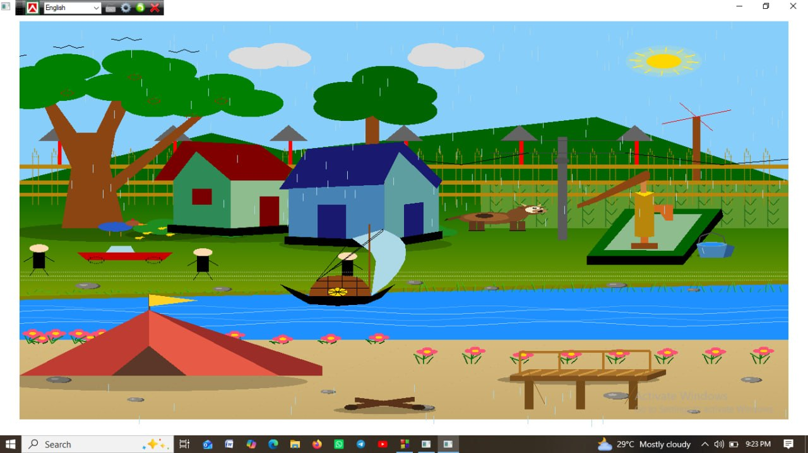
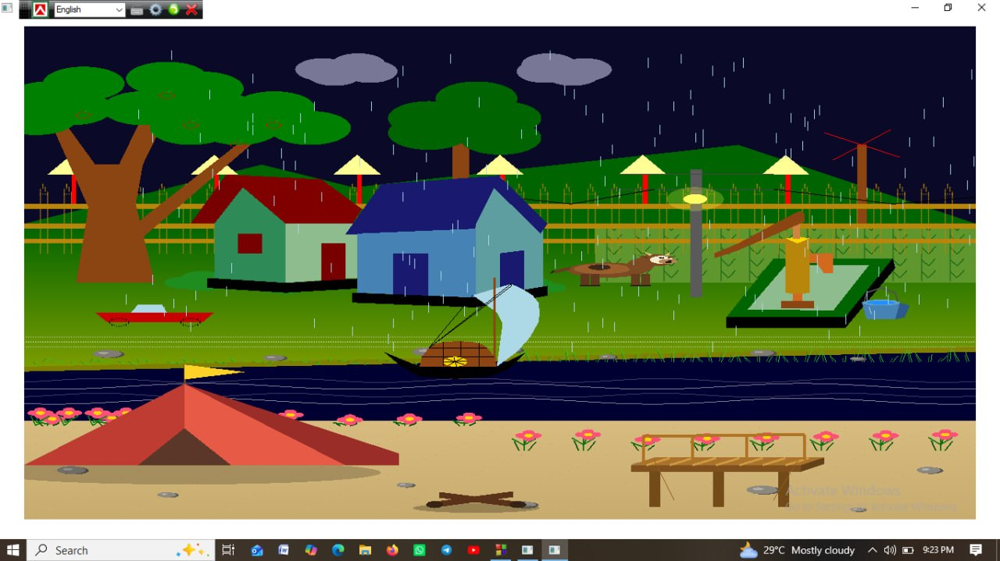

# Whisper of the Countryside

### An Animated Rural Village Scene Using C & OpenGL

**Whisper of the Countryside** is an interactive **Computer Graphics project developed in C using OpenGL and GLUT**. The project creates a visually rich rural countryside environment containing houses, rice fields, trees, a river, boats, animals, people, birds, a windmill, a tubewell, electric poles, solar lights, and other elements of village life.

The scene combines **2D computer graphics algorithms, geometric transformations, animation, lighting effects, environmental changes, and sound effects** to create an immersive animated countryside experience.

---

## Project Overview

The project demonstrates how fundamental computer graphics concepts can be combined to construct a complete animated environment from geometric primitives.

The scene continuously changes between **day and night**, while multiple objects move independently. The river contains animated water ripples and fish, a boat travels across the river, clouds move across the sky, people and birds move through the environment, and nighttime introduces stars, fireflies, moonlight, and artificial lighting.

The project also includes interactive keyboard controls for controlling the boat scale, rain, car movement, day/night mode, and sound effects.

---

## Features

### Natural Environment

* Rural village landscape
* Green fields and rice paddies
* Animated river
* Riverbank with grass and stones
* Trees with apples
* Moving clouds
* Windmill
* Rural houses
* Tubewell and bucket
* Electric pole and wires
* Fence and walking path

### Animated Objects

* Moving boat
* Rotating boat gear
* Animated fish
* Flying birds
* Moving clouds
* Walking villagers
* Moving car
* Twinkling stars
* Animated fireflies
* Flowing river ripples
* Rotating sun rays

### Day & Night System

The project contains an automatic day/night cycle.

* Daytime includes a moving sun, birds, villagers, and bright environmental lighting.
* Nighttime includes a moon, stars, fireflies, solar lights, and darker river/sky colors.
* The scene automatically switches between day and night approximately every **10 seconds**.
* Manual day/night switching is also supported through keyboard controls.

### Weather System

The project includes an interactive rain system.

* Rain can be enabled and disabled using keyboard controls.
* Rainfall is generated using multiple animated rain particles.
* During rainy nights, stars and the moon are hidden to create a more realistic atmosphere.
* Fish animation is paused during rainfall.

### Sound Effects

The project uses the Windows Multimedia API through `mciSendStringA()` to provide environmental audio.

Implemented sounds include:

* Continuous river/water sound
* Car horn sound
* Independent playback of multiple sound effects

---

## Computer Graphics Concepts Used

This project demonstrates several fundamental computer graphics techniques.

### Line Drawing Algorithms

**DDA (Digital Differential Analyzer)** is implemented for drawing lines.

```c
void DDA(float x1, float y1, float x2, float y2)
```

**Bresenham's Line Drawing Algorithm** is also implemented.

```c
void drawLineBresenham(int x1, int y1, int x2, int y2)
```

These algorithms are used for elements such as paths, fences, and other line-based objects.

### Midpoint Circle Algorithm

A midpoint-based circle drawing function is implemented for circular objects.

```c
void drawCircle(int xc, int yc, int r)
```

It is used for objects such as:

* Wheels
* Fish eyes
* Apples
* Circular components
* Other geometric details

### Geometric Transformations

The project uses OpenGL transformations including:

* Translation
* Rotation
* Scaling

Examples include:

* Moving the boat
* Rotating the windmill
* Rotating the gear
* Scaling the boat
* Moving people and vehicles
* Animating the sun

### Animation

Continuous animation is implemented through frame-based updates and GLUT redisplay.

Animated components include:

* Boat
* Fish
* Clouds
* Birds
* Villagers
* Car
* Windmill
* Gear
* Stars
* Fireflies
* River ripples
* Sun rays

### Lighting & Transparency

OpenGL blending and alpha transparency are used for effects such as:

* Sun glow
* Moon glow
* Firefly effects
* Solar light glow
* Water ripple transparency

The project enables blending using:

```c
glEnable(GL_BLEND);
glBlendFunc(GL_SRC_ALPHA, GL_ONE_MINUS_SRC_ALPHA);
```

---

## Interactive Controls

| Key | Function            |
| --- | ------------------- |
| `+` | Increase boat size  |
| `-` | Decrease boat size  |
| `r` | Reset boat size     |
| `s` | Start rain          |
| `t` | Stop rain           |
| `a` | Move car left       |
| `d` | Move car right      |
| `h` | Play car horn       |
| `D` | Switch to daytime   |
| `N` | Switch to nighttime |

The controls are implemented through the GLUT keyboard callback.

---

## Technologies Used

| Technology                   | Purpose                                               |
| ---------------------------- | ----------------------------------------------------- |
| **C**                        | Core programming language                             |
| **OpenGL**                   | 2D graphics rendering                                 |
| **GLUT**                     | Window management, rendering loop, and keyboard input |
| **Windows API**              | System-level functionality                            |
| **MCI / Windows Multimedia** | Audio playback                                        |
| **Math Library**             | Trigonometric calculations and geometric animation    |

---

## Project Structure

```text
Whisper-of-the-country-side/
│
├── assets/
│   └── Project assets and resources
│
├── CG final.c
│   └── Main C/OpenGL source code
│
├── Project report.pdf
│   └── Complete project documentation
│
└── README.md
    └── Project documentation
```

The repository currently follows this structure.

---

## System Requirements

### Hardware

* Any modern Windows PC
* Minimum 4 GB RAM
* Standard keyboard and display

### Software

* Windows operating system
* C compiler
* OpenGL
* GLUT / FreeGLUT
* Code::Blocks, Visual Studio, or another compatible C/C++ IDE

---

## Installation & Setup

### 1. Clone the Repository

```bash
git clone https://github.com/jannatul-fredaues/Whisper-of-the-country-side.git
```

### 2. Open the Project

Open:

```text
CG final.c
```

using a C/OpenGL-compatible IDE such as Code::Blocks or Visual Studio.

### 3. Configure OpenGL & GLUT

Make sure the following libraries are available:

* OpenGL
* GLUT / FreeGLUT
* Windows Multimedia Library

The source code includes the required OpenGL and Windows multimedia headers.

### 4. Configure Audio Assets

The current source references `.wav` audio files for the river and car horn. Before running the application, update the audio file paths in the source code to match the location of your local audio files.

For example:

```c
playLoopSound("path/to/river.wav", "riverSound");
```

and:

```c
playOnceSound("path/to/horn.wav", "hornSound");
```

### 5. Build and Run

Compile the program and run the generated executable.

The application opens a **1200 × 800** OpenGL window titled:

```text
village scenery
```

The initialization and GLUT configuration are defined in the project's main C source file.

---

## How the Animation Works

The project uses a continuously running GLUT rendering loop.

During each update:

1. Objects are rendered.
2. Their positions or states are updated.
3. `glutPostRedisplay()` requests another frame.
4. Animation variables are modified.
5. The scene is rendered again.

For example, the boat continuously moves horizontally and resets when it leaves the scene. The gear continuously rotates, while the sun and moon follow their respective day/night trajectories.

---

## Day/Night Cycle

The automatic day/night system uses elapsed GLUT time.

Each phase lasts approximately **10 seconds**:

```text
DAY
 ↓
Sun moves across the sky
 ↓
NIGHT
 ↓
Moon moves across the sky
 ↓
DAY
 ↓
Repeat
```

The source also provides manual controls through `D` and `N` for switching between daytime and nighttime.

---

## Learning Outcomes

This project demonstrates practical understanding of:

* 2D computer graphics
* OpenGL rendering
* GLUT event handling
* DDA line drawing
* Bresenham line drawing
* Midpoint circle drawing
* Geometric transformations
* Animation techniques
* Particle-style rain animation
* Alpha blending
* Lighting effects
* Keyboard interaction
* Audio integration
* Scene composition
* Coordinate systems
* Real-time rendering

---

## Future Improvements

Possible future enhancements include:

* 3D countryside environment
* Improved character animations
* More realistic water simulation
* Texture mapping
* Dynamic shadows
* Improved lighting models
* Weather variations such as fog and storms
* More interactive village objects
* Mouse-based interaction
* Camera movement and zoom
* Better audio management using configurable asset paths
* Cross-platform support

---

## Project Purpose

The primary purpose of **Whisper of the Countryside** is to demonstrate how fundamental computer graphics algorithms and OpenGL techniques can be integrated into a complete interactive environment.

Rather than rendering a static image, the project focuses on **animation, interaction, environmental transitions, and multimedia integration** to create a dynamic representation of rural life.

---

## Author

**Jannatul Ferdaues**

B.Sc. in Computer Science & Engineering
Daffodil International University

GitHub: [jannatul-fredaues](https://github.com/jannatul-fredaues)

---

## Academic Project

**Course:** Computer Graphics
**Project Type:** Interactive 2D Graphics & Animation
**Language:** C
**Graphics Library:** OpenGL + GLUT

---

## License

This project is intended primarily for **academic and educational purposes**.

If you reuse or modify the project, please provide appropriate attribution to the original author.

---

## Acknowledgement

This project was developed as part of an academic Computer Graphics project to explore the implementation of classical graphics algorithms, OpenGL primitives, animation, interaction, and multimedia effects in a complete visual scene.

---

## Preview




